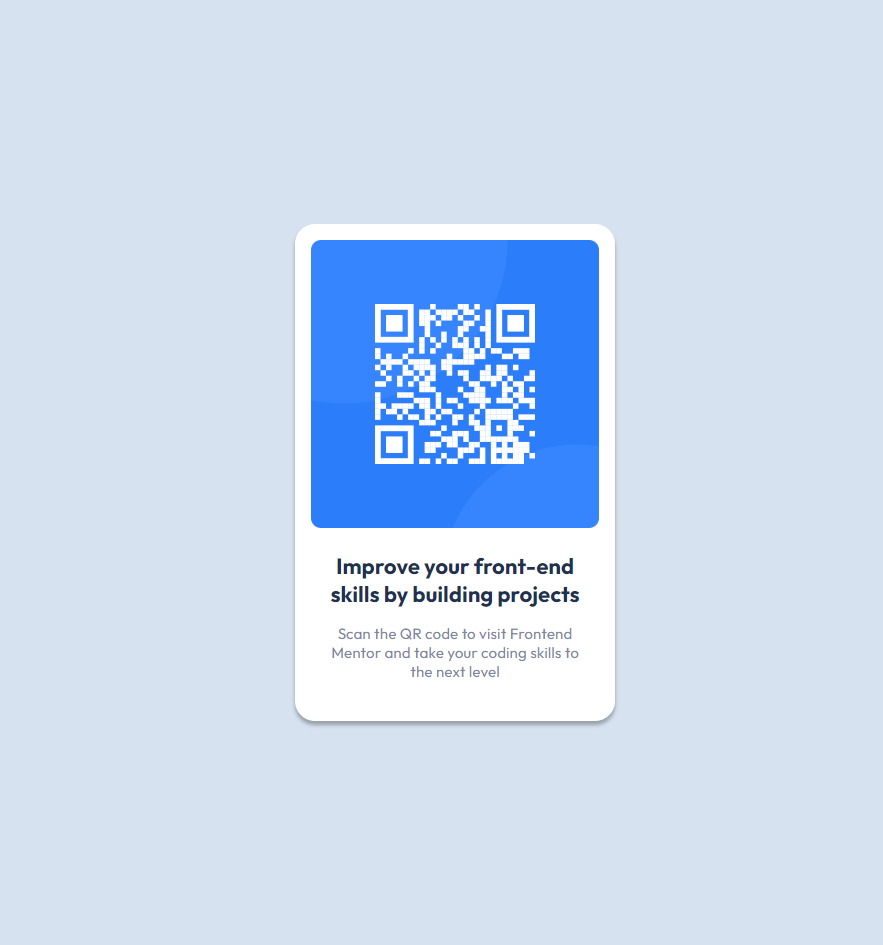

# Frontend Mentor - QR code component solution

This is a solution to the [QR code component challenge on Frontend Mentor](https://www.frontendmentor.io/challenges/qr-code-component-iux_sIO_H). Frontend Mentor challenges help you improve your coding skills by building realistic projects. 

## Table of contents

- [Overview](#overview)
  - [Screenshot](#screenshot)
  - [Links](#links)
- [My process](#my-process)
  - [Built with](#built-with)
  - [Continued development](#continued-development)
- [Author](#author)

**Note: Delete this note and update the table of contents based on what sections you keep.**

## Overview

### Screenshot

### Links

- Live Site URL: [My Solution](https://qr-code-component-sable-tau.vercel.app/)

## My process

### Built with

- Semantic HTML5 markup
- CSS custom properties
- SASS
- Flexbox

### Continued development

I will take some time do learn how to write better sass and give better names for my classes, for my future projects.

## Author

- Frontend Mentor - [@MuliroMatt](https://www.frontendmentor.io/profile/MuliroMatt)
- Linkedin  - [Murilo Amorim Mattiuzzi](https://www.linkedin.com/in/murilo-amorim-mattiuzzi-6589752ab/)

